# Intelligence Cubed (i³) – Linera

<div align="center">


**The AI Model Nasdaq**

Where AI models are both **Model-as-a-Service (MaaS)** and **liquid, revenue-sharing assets**. Discover, compare, and compose models in a visual Canvas with transparent **LIN** and **on-chain x402 payments** on **Linera**.

[](https://opensource.org/licenses/MIT)
[](https://nodejs.org/)
[](https://explorer.testnet-conway.linera.net)
[](https://explorer.testnet-conway.linera.net)
[](https://explorer.testnet-conway.linera.net)

[Twitter](https://x.com/I3_Cubed) | [Telegram](https://t.me/I3_Cubed)

</div>

---

## 📚 Table of Contents
1. [Overview](#1-overview)
2. [What the Product *Is*](#2-what-the-product-is)
3. [Problem & Solution](#3-problem--solution)
4. [Core Concepts](#4-core-concepts)
5. [Key Features](#3️⃣-key-features)
   - [Multi-Page AI Hub](#multi-page-ai-hub)
   - [x402 & On-chain Payments](#x402--on-chain-payments)
6. [How x402 & Linera Payments Work](#4️⃣-how-x402--linera-payments-work)
   - [A) Single-Model Chat Flow](#a-single-model-chat-flow)
   - [B) Modelverse / Benchmark "Try" Flow](#b-modelverse--benchmark-try-flow)
   - [C) Workflow & Canvas Flow](#c-workflow--canvas-flow)
   - [D) Prepaid API Calls](#d-prepaid-api-calls-token-purchase)
   - [E) Share Purchase](#e-share-model-ownership-purchase)
7. [User Journey](#5️⃣-user-journey)
   - [Core User Flows](#core-user-flows-x402-payment-first-approach)
   - [Detailed User Journey](#detailed-user-journey-with-x402-payments)
8. [Architecture & Tech Stack](#6️⃣-architecture--tech-stack)
   - [High-Level System Architecture](#high-level-system-architecture)
   - [Component Architecture](#component-architecture)
   - [Data Flow Architecture](#data-flow-architecture-with-x402-payments)
   - [Architecture Components](#architecture-components)
9. [Technology Stack](#7️⃣-technology-stack)
10. [Getting Started](#8️⃣-getting-started)
    - [Prerequisites](#prerequisites)
    - [Linera Configuration](#linera-configuration)
    - [Clone & Install](#clone--install)
    - [Environment Variables](#environment-variables)
11. [Local Development](#9️⃣-local-development)
    - [Frontend (Vite dev server)](#frontend-vite-dev-server)
    - [Backend / MCP server](#backend--mcp-server)
    - [Production Build](#production-build)
12. [License](#-license)

---
# Intelligence Cubed (i³)

> The **Nasdaq for AI models** — a decentralized **Modelverse** where models are both **Model-as-a-Service (MaaS)** and **liquid, revenue-sharing assets**. Discover, compare, and compose models in a visual Canvas; pay per call with transparent LIN pricing; and get verifiable on-chain receipts via **x402**.

---

## 1) Overview

**Intelligence Cubed (i³)** is the **Nasdaq for AI models** — a decentralized modelverse that lets users:

- Discover curated AI models with transparent **LIN**  
- Benchmark and compare models with community-driven **Proof of Intelligence**  
- Build and run multi-step workflows in a **Canvas** editor  
- Chat with any model or workflow via a unified **Chats** interface

Every paid action (single model call or workflow run) is **gated by x402 invoices** and settled in **LIN on Linera** via **MetaMask** (as Linera signer). Only **after** on-chain payment confirmation does the app invoke the underlying model(s) and stream back the answer.

---

## 2) What the Product *Is*

i³ is four layers that work together:

1. **Model-as-a-Service (MaaS)**  
   Call models directly via chat/API, chain them into workflows, and enable fine-tuning and secondary creation.

2. **Model as a Liquid Asset**  
   Tokenize models through **IMO (Initial Model Offering)** so ownership and usage revenues are shared transparently.

3. **Co-Creation (Canvas)**  
   Drag-and-drop to compose multi-step pipelines; derivative models automatically return royalties to ancestors.

4. **Democratic Benchmark (Proof of Intelligence)**  
   Usage-driven rankings and indices so the best models rise on merit, not just lab tests.

> **Open-source threshold:** when **>51%** of a model's ownership is publicly held, the model transitions to open source to accelerate adoption and remixing.

---

## 3) Problem & Solution

### Problems
- **Model discovery gap:** Lists are long, quality varies, pricing is opaque, and router logic is often a black box.  
- **Payment gap:** Most AI apps are centralized, credit- or subscription-based. There's no standard way for third-party agents to **programmatically** pay per call and obtain **verifiable on-chain receipts**.

### Our Solution
- **Modelverse + Benchmark + Workflows + Canvas** for one-stop **discover → compare → compose**.  
- **Tokenized ownership & royalties** (IMO + derivative revenue share) for sustainable creator incentives.  
- **Unified x402 payment layer**: each call is invoiced, paid, verified on-chain, then executed.

---

## 4) Core Concepts

- **IMO (Initial Model Offering):** Creators mint model ownership, fund development, and share future usage revenues.  
- **Royalties Accumulation:** Derivative models automatically pay upstream royalties across the lineage.  
- **Proof of Intelligence:** Continuous, usage-driven scoring and vertical indices (quality, usage, momentum).  
- **Democratic Pricing:** Stablecoin-anchored pricing that reflects demand and capacity, not arbitrary fees.

---


## 3️⃣ Key Features

### Multi-Page AI Hub

* **Chats (`index.html`)**  
  Single-model or Auto Router chat interface with a central input box:

  * "Ask AI anything…" prompt
  * **Auto Router** toggle: when enabled, the system scores hundreds of models and picks the best suited one for the user's query.

* **Modelverse (`modelverse.html`)**  
  Model marketplace with:

  * Name, category, industry
  * **Price / API call (LIN)**
  * Usage, compatibility, total score
  * Actions: **Try** (jump into Chats) & **Add to Cart**

* **Benchmark (`benchmark.html`)**  
  Model benchmark leaderboard showing:

  * Performance scores
  * Usage metrics
  * Price & market stats
  * One-click "Try" into Chats.

* **Workflows (`workflow.html`)**  
  Workflow leaderboard:

  * Each card shows **Compute Cost**, **Estimated Gas**, and **Total (x402)** in LIN.
  * Actions: **Details**, **Pay with x402**.
  * **Two payment modes**: Prepay once (single tx for all nodes) or Pay per node.

* **Canvas (`canvas.html`)**  
  Visual workflow editor:

  * Drag-and-drop nodes (models)
  * Connect them into multi-step pipelines
  * Click **Run** to execute — choose **Prepay once** or **Pay per node**.

* **MyCart (`mycart.html`)**  
  Shopping cart for bulk purchases:

  * Add models from Modelverse to cart.
  * Purchase **API call tokens** (prepaid credits) and **ownership shares**.
  * Batch checkout with x402 payment.

### x402 & On-chain Payments

* **402 Payment Progress widget** in the bottom-right shows:

  * Invoice status (Pending → Paid / Cancelled)
  * Amount, memo, and Linera tx / explorer link.
* **MetaMask (Linera signer)** integration:

  * Users log in and confirm each payment.
  * Every payment is visible on **Linera Explorer**.
* **Prepaid Credits**: Pre-purchase API calls; use them later without additional payments.
* **Daily Check-in**: Claim daily LIN rewards to offset usage costs.

---

## 4️⃣ How x402 & Linera Payments Work

### A. Single-Model Chat Flow

1. User opens **Chats** (`index.html`), selects a model (or enables Auto Router), and sends a question, e.g. `"What does this do?"`.
2. The frontend sends the request to the MCP server; the server:

   * Calculates the model price in LIN.
   * Creates a **x402 payment** describing the required payment.
3. The UI shows a **x402 Payment Progress** card and prompts the user to **connect MetaMask (Linera)**.
4. MetaMask pops up:

   * User approves the LIN transfer (signature / on-chain transfer).
5. Once the transaction is confirmed:

   * The 402 card shows **Paid – Payment settled on Linera**, including:

     * Amount (LIN)
     * Memo (invoice ID)
     * Explorer link to **Linera Explorer** (where applicable).
6. Only then does the MCP server forward the prompt to the selected model and stream the answer back into the chat.

### B. Modelverse / Benchmark "Try" Flow

1. User visits **Modelverse** or **Benchmark** and clicks **Try** next to a model.
2. They are redirected to **Chats** with that model pre-selected.
3. They ask a question; the **same x402 flow** (invoice → MetaMask → Linera → answer) runs automatically.

### C. Workflow & Canvas Flow

Users can run multi-model workflows with **two payment options**:

#### Option 1: Prepay Once (Recommended)
Pay a single transaction upfront for all nodes in the workflow.

1. User opens **Workflows** and clicks **Pay with x402** on a workflow card.
2. A dialog appears: **"Prepay once"** vs. **"Pay per node"** — user selects **Prepay once**.
3. The app requests a **single x402 invoice** covering all nodes:
   * Backend calculates total cost = Σ (compute cost + gas) for all nodes.
   * Returns a 402 with a detailed **cost breakdown** per node.
4. User pays once via MetaMask (single transaction).
5. After payment verification, the user receives a **workflow_session_id**.
6. The app opens **Canvas** (or redirects to **Chats**); all nodes execute **without additional payments**.

#### Option 2: Pay Per Node
Pay for each node separately as it executes.

1. User selects **Pay per node** in the dialog.
2. The app opens **Canvas**, pre-loading the workflow graph.
3. User clicks **Run**; backend returns a 402 for the **first node only**.
4. User pays via MetaMask; node executes.
5. Backend returns a 402 for the **next node**; repeat until all nodes complete.
6. Final results surface back through the **Chats** interface.

| Mode | Transactions | Use Case |
|------|--------------|----------|
| **Prepay Once** | 1 | Run entire workflow seamlessly |
| **Pay Per Node** | N (one per node) | Review/cancel midway |

### D. Prepaid API Calls (Token Purchase)

Users can **pre-purchase API calls** from Modelverse or MyCart. Once purchased, subsequent model invocations are **free** until the credits are exhausted.

1. User visits **Modelverse** and clicks **Buy Tokens** (or adds to cart via **MyCart**).
2. An x402 invoice is generated for the desired number of API calls.
3. User pays via MetaMask; tokens are credited to their account.
4. When the user later invokes the same model:
   * Frontend detects **prepaid credits** in `localStorage`.
   * Sends a special header: `X-PAYMENT: prepaid model=xxx; remaining=N; nonce=...`
   * Backend **skips payment verification** and executes the model directly.
   * Remaining credits are decremented locally.
5. When credits reach zero, the user must purchase more or pay per-call.

### E. Share (Model Ownership) Purchase

Users can buy **ownership shares** of AI models via the `/mcp/share.buy` endpoint:

1. User selects a model and chooses **Buy Shares**.
2. Backend generates an x402 invoice for the share price × quantity.
3. User pays via MetaMask; shares are recorded in **My Assets**.
4. Share ownership enables:
   * Revenue sharing from model usage fees.
   * Governance rights (future roadmap).
   * Open-source transition when >51% is publicly held.

---

## 5️⃣ User Journey

### Core User Flows (x402 Payment-First Approach)

```mermaid
flowchart TD
    Start[🌐 User Lands on Platform] --> Auth{🔐 Wallet Connected?}
    
    Auth -->|No| WalletConnect[Connect MetaMask Wallet]
    WalletConnect --> LineraAuth["Linera"]
    LineraAuth --> Authenticated[✅ Authenticated]
    
    Auth -->|Yes| Authenticated
    
    Authenticated --> MainHub{Choose Action}
    
    subgraph Discovery["🔍 Discovery Flow"]
        D1[Browse Modelverse] --> D2[Filter & Search]
        D2 --> D3[View Model Details - LIN]
        D3 --> D4[Compare in Benchmark]
        D4 --> D5[Record View On-Chain]
    end
    
    subgraph Payment["💳 x402 Payment Flow"]
        P1[Create x402 Invoice] --> P2[Display LIN Amount]
        P2 --> P3[User Approves in MetaMask]
        P3 --> P4["Linera Transaction Confirmed"]
        P4 --> P5[Verifiable On-Chain Receipt]
    end
    
    subgraph Chat["💬 Chat Flow with x402"]
        C1[Open Chat Interface] --> C2{Auto Router?}
        C2 -->|ON| C3[AI Selects Best Model]
        C2 -->|OFF| C4[User Selects Model]
        C3 --> C5[Create x402 Invoice]
        C4 --> C5
        C5 --> C6[Pay with LIN]
        C6 --> C7[Payment Verified]
        C7 --> C8[Stream AI Response]
        C8 --> C9[Record Usage On-Chain]
    end
    
    subgraph Canvas["🎨 Canvas Flow with Multi-Step x402"]
        W1[Create Workflow] --> W2[Drag Model Nodes]
        W2 --> W3[Connect Pipeline]
        W3 --> W4[Calculate Total LIN Cost]
        W4 --> W5{Payment Mode}
        W5 -->|Prepay Once| W6A[Pay All Nodes Once]
        W5 -->|Pay Per Node| W6B[Pay Node-by-Node via x402]
        W6A --> W7[Execute Workflow]
        W6B --> W7
        W7 --> W8[Log Execution On-Chain]
    end
    
    MainHub -->|Discover| D1
    MainHub -->|Chat| C1
    MainHub -->|Build| W1
    
    C1 --> P1
    W1 --> P1
    
    D5 --> MyAssets[💼 Save to My Assets]
    C9 --> MyAssets
    W8 --> MyAssets
    
    MyAssets --> TokenRewards[🎁 Earn LIN Rewards]
    TokenRewards --> MainHub
    
    style Start fill:#FFE082,stroke:#FFA000
    style Auth fill:#FF5252,stroke:#D32F2F,color:#fff
    style Authenticated fill:#4CAF50,stroke:#45a049,color:#fff
    style Discovery fill:#8B7CF6,stroke:#6B5CD6,color:#fff
    style Payment fill:#9945FF,stroke:#14F195,color:#fff
    style Chat fill:#00BCD4,stroke:#0097A7,color:#fff
    style Canvas fill:#FF9800,stroke:#F57C00,color:#fff
    style MyAssets fill:#E91E63,stroke:#C2185B,color:#fff
```



### Detailed User Journey with x402 Payments

```mermaid
sequenceDiagram
    actor User
    participant UI as Web Interface
    participant MetaMask as MetaMask Wallet
    participant Linera as Linera
    participant x402 as x402 Protocol
    participant API as MCP Server
    participant Router as Auto Router
    participant Model as AI Models
    
    User->>UI: 1. Land on Platform
    UI->>UI: Check Wallet Connection
    
    alt Not Connected
        UI->>User: Show "Connect MetaMask" Modal
        User->>UI: Click Connect MetaMask
        UI->>MetaMask: Request Connection
        MetaMask->>User: Approve Connection
        MetaMask-->>UI: Wallet Address (Linera)
        UI->>Linera: Verify Wallet Signature
        Linera-->>UI: ✅ Authenticated
    else Already Connected
        UI->>Linera: Verify Session
        Linera-->>UI: ✅ Session Valid
    end
    
    UI->>User: Display Main Interface
    
    rect rgb(100, 150, 255)
        Note over User,Model: Chat Flow with x402 Payment (LIN on Linera)
        User->>UI: Ask Question in Chat
        UI->>API: Send Query + Wallet Address
        
        alt Auto Router Enabled
            API->>Router: Analyze Query
            Router->>Router: Score 100+ Models
            Router->>API: Select Best Model
        else Manual Selection
            User->>UI: Choose Model
            UI->>API: Use Selected Model
        end
        
        API->>x402: Create Invoice (LIN Amount)
        x402-->>API: Invoice ID + Payment Details
        API-->>UI: Display x402 Invoice
        
        UI->>User: Show Payment Modal
        Note over User,Linera: User sees LIN amount
        
        User->>MetaMask: Approve LIN Payment
        MetaMask->>Linera: Submit Transaction
        Linera-->>MetaMask: Transaction Hash
        MetaMask-->>UI: Payment Confirmed
        
        UI->>x402: Verify Payment On-Chain
        x402->>Linera: Check Transaction
        Linera-->>x402: ✅ LIN Transfer Verified
        x402-->>UI: Payment Receipt + Explorer Link
        
        Note over UI,User: Display: "Paid - Payment settled on Linera"
        
        API->>Model: Forward Query (After Payment)
        Model-->>API: Stream Response
        API-->>UI: Stream to Client
        UI-->>User: Display AI Answer
        
        API->>Linera: Record Usage Metadata On-Chain
        Linera-->>UI: Update User's Transaction History
    end
    
    rect rgb(200, 150, 100)
        Note over User,Model: Canvas Flow with Multi-Node x402 Payments
        User->>UI: Create Workflow in Canvas
        User->>UI: Drag & Connect Model Nodes
        User->>UI: Click "Run Workflow"
        
        UI->>API: Request Workflow Execution
        API->>API: Calculate Total Cost (All Nodes)
        API-->>UI: Display Total LIN Amount
        
        alt Prepay Once Mode
            API->>x402: Create Total Invoice
            x402-->>UI: Invoice for All Nodes
            
            User->>MetaMask: Approve LIN Payment
            MetaMask->>Linera: Submit Transaction
            Linera-->>MetaMask: Tx Confirmed
            
            x402->>Linera: Verify Payment
            Linera-->>x402: ✅ Verified
            
            loop For Each Node
                API->>Model: Execute Node N
                Model-->>API: Node Results
                API-->>UI: Stream Node Output
            end
        else Pay Per Node Mode
            loop For Each Node
                API->>x402: Create Node Invoice
                x402-->>UI: Invoice for Node N
                
                User->>MetaMask: Approve LIN Payment
                MetaMask->>Linera: Submit Transaction
                Linera-->>MetaMask: Tx Confirmed
                
                x402->>Linera: Verify Payment
                Linera-->>x402: ✅ Verified
                
                API->>Model: Execute Node N
                Model-->>API: Node Results
                API-->>UI: Stream Node Output
            end
        end
        
        UI->>Linera: Record Workflow Execution
        Linera-->>UI: On-Chain Receipt
        UI->>User: Display Final Results + All Tx Links
    end
```



---

## 6️⃣ Architecture & Tech Stack

### High-Level System Architecture


### Component Architecture


### Data Flow Architecture with x402 Payments


### Architecture Components

#### 1. **Frontend Layer** (HTML/CSS/JavaScript + Vite)
- Multi-page application with distinct interfaces
- **x402 Payment Progress Widget** for real-time payment status
- MetaMask wallet integration for Linera (as signer)
- Real-time streaming responses from AI models
- Responsive design with modern UI/UX

#### 2. **Application Layer** (Node.js/Express)
- RESTful API endpoints (`/api/*`)
- **MCP Server routes** (`/mcp/*`) for x402 payment handling
- Model selection and routing logic (Auto Router)
- Session and state management
- I3 Gateway for model orchestration

#### 3. **Blockchain Layer - Linera**
- **Linera (Testnet Conway)**: Web3 infrastructure for payments and receipts
- **LIN Token**: Native payment token
- **MetaMask Wallet**: User authentication and payment approval (Linera signer)
- **On-Chain Verification**: Every payment is verifiable on Linera Explorer
- **Transaction Receipts**: Immutable proof of payment

#### 4. **x402 Payment Layer**
- **Invoice Creation**: Generate payment requests with LIN amounts
- **Payment Polling**: Real-time status updates (Pending → Paid → Verified)
- **On-Chain Verification**: Confirm LIN transfers on Linera
- **Receipt Generation**: Provide Linera Explorer links for each transaction
- **Billing Logs**: Local JSON logging for reconciliation

#### 5. **AI Model Layer**
- Multiple AI model providers
- I3 Gateway for unified model access
- Response streaming for real-time interactions
- Usage tracking and analytics
- Pay-per-call execution model

#### 6. **Data Layer**
- **Model Registry**: Metadata, pricing, and capability information
- **Billing Entries**: `data/billing-entries.json` for transaction logs
- **User Profiles**: Wallet-based identity and transaction history

### Data Flow Summary

1. **User Action** → Frontend captures intent (chat query, workflow execution)
2. **x402 Invoice** → Create payment request with LIN amount
3. **MetaMask Approval** → User approves LIN transfer on Linera
4. **Payment Verification** → Confirm on-chain transaction
5. **Model Selection** → Auto Router or user selects appropriate model(s)
6. **API Request** → Forward to I3 Gateway after payment confirmation
7. **Model Execution** → Execute AI model and stream response
8. **On-Chain Receipt** → Generate verifiable Linera Explorer link
9. **Billing Log** → Record transaction in local JSON for reconciliation

---

## 7️⃣ Technology Stack

### Frontend
- **HTML5/CSS3**: Modern web standards
- **JavaScript (ES6+)**: Client-side logic
- **Vite**: Build tool and dev server
- **MetaMask SDK**: Linera wallet (signer) integration
- **@linera/client / @linera/metamask**: Linera SDK for transfers

### Backend
- **Node.js (≥18)**: Runtime environment
- **Express.js**: Web framework
- **CORS**: Cross-origin resource sharing
- **I3 Gateway**: Unified API gateway for AI models

### Blockchain & Payments
- **Linera (Testnet Conway)**: Faucet and explorer for testnet
- **LIN Token**: Native payment token
- **x402 Protocol**: Payment invoice standard
- **MetaMask Wallet**: User authentication and payments (Linera signer)

### Data & Storage
- **JSON File System**: Local billing logs (`data/billing-entries.json`)
- **Model Registry**: Metadata and pricing database

### AI/ML
- **Auto Router**: Intelligent model selection system
- **I3 API**: Standardized interface for all models
- **Streaming Responses**: Real-time text generation

---

## 8️⃣ Getting Started

### Prerequisites

* **Node.js** ≥ 18
* **npm** ≥ 8 (or `yarn`)
* **MetaMask** wallet installed in your browser (used as **Linera signer**)
* Optional but recommended: claim testnet chain and LIN from **Linera Faucet** for testing.

### Linera Configuration

Linera Testnet Conway is used for payments and receipts. Key endpoints:

| Field | Value |
|-------|-------|
| Network Name | Linera Testnet Conway |
| Faucet URL | `https://faucet.testnet-conway.linera.net` |
| Explorer URL | `https://explorer.testnet-conway.linera.net` |

Connect your wallet via the in-app **Connect Linera** flow; the app can claim a chain and LIN from the faucet for you.

### Clone & Install

```bash
git clone <TODO: repository-url>
cd Linera_i3_app
npm install
# or
yarn install
```

### Environment Variables

You can export these in your shell or use a `.env` file (with `dotenv` wired into `serve.js`):

* **Server basics**

  * `PORT` – default `3000` (often mapped to `8080` in production)
  * `HOST` – default `127.0.0.1` (use `0.0.0.0` to listen on all interfaces)
  * `NODE_ENV` – `development` or `production`

* **Model proxy**

  * `I3_PROXY_BASE` – base URL of the proxy (e.g. `http://localhost:8000`)

* **x402 / Linera settings** (can also live in `server/mcp/config.js`)

  * `X402_NETWORK` – e.g. `linera-testnet-conway`
  * `X402_RECIPIENT` – your merchant/agent wallet address
  * `X402_PAYMENT_URL` – optional x402 facilitator endpoint
  * `X402_EXPLORER_URL` – Linera Explorer base URL (`https://explorer.testnet-conway.linera.net`)
  * `X402_EXPIRES_SECONDS` – invoice expiry duration in seconds

Ensure that `data/billing-entries.json` exists, is writable, and follows `{ "entries": [] }`. The repo ships with a sample file; replace it with an empty structure if you need a clean slate.

---

## 9️⃣ Local Development

**To use x402 payments or MCP calls in Chats, you must run both the frontend and the backend.**

### Development mode (recommended)

**Start backend and frontend with one command:**

```bash
npm run dev:full
```
* The backend runs Express at `http://localhost:3000` serving `/mcp/*` and `/api/*`; the frontend runs via Vite (e.g. port 5173), and requests to `/mcp` and `/api` are **proxied** to the backend to avoid 404.

**Or use two terminals:**

**Terminal 1 – Backend (MCP / x402 API):**
```bash
node serve.js
```
* Starts Express at `http://localhost:3000` serving `/mcp/*` and `/api/*`.

**Terminal 2 – Frontend:**
```bash
npm run dev
```
* After Vite starts, open the app at the given port; requests to `/mcp` and `/api` must be **proxied** to the backend port, or you will get 404.

If you only run `npm run dev` without the backend, `POST /mcp/models.invoke` will return **404** and chat will show "server returned empty response".

### Frontend only (no MCP)

```bash
npm run dev
```
* Port is determined by Vite; hot reload. Without the backend, x402 / model calls are not available.

### Production mode (single process)

```bash
npm run build
npm start
```
* `serve.js` serves static assets plus `/api/*` and `/mcp/*` on port 3000; no Vite needed.

### Production Build

```bash
npm run build
npm run preview     # optional local preview of the built assets
```

In production, you typically:

1. `npm run build`
2. `npm start` (or `node serve.js`) behind a reverse proxy.

---

## 🧾 License

This project is licensed under the **MIT License** – see the [`LICENSE`](./LICENSE) file for details.
